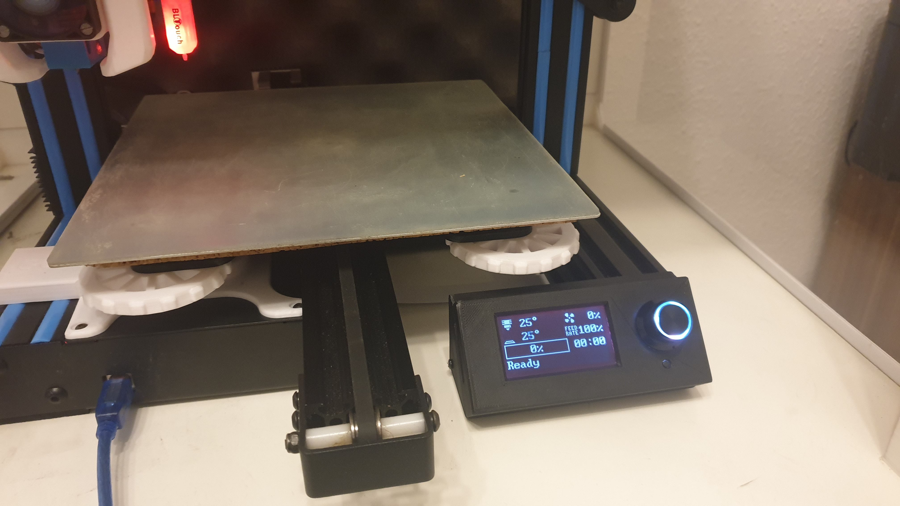
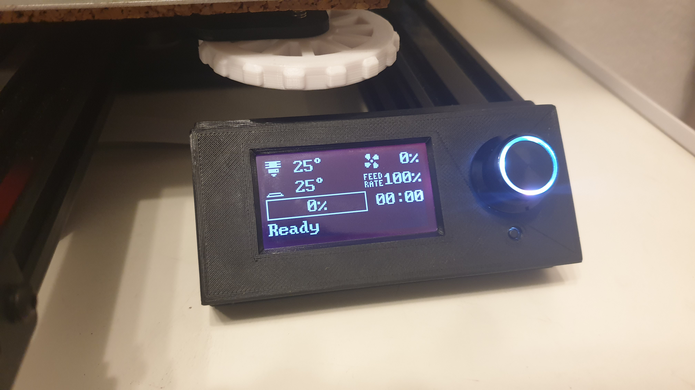
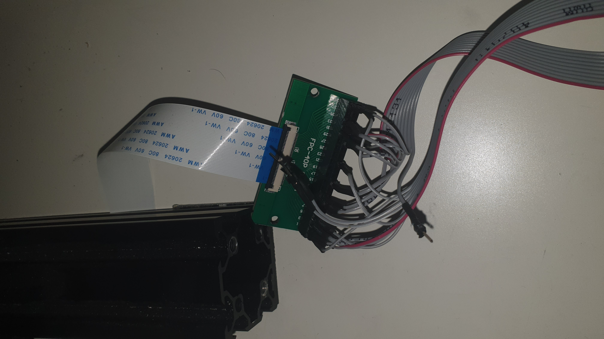
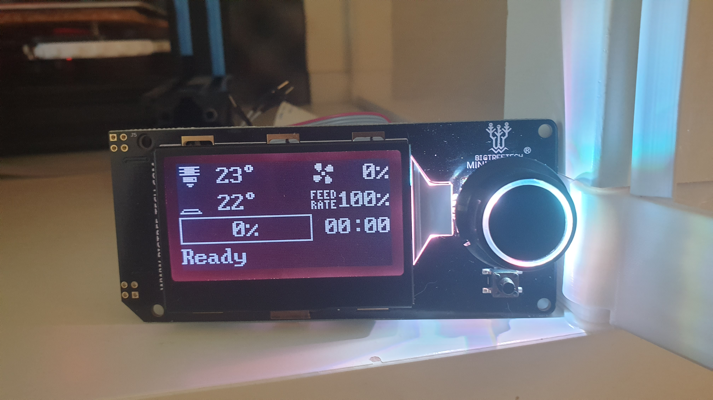

# How to upgrade Geeetech A10 with BIGTREETECH / Fystec Mini12864
I want to show here how to use a Mini12864 Display from [BIGTREETECH](https://www.bigtree-tech.com/products/bigtreetech-mini12864-v1-0.html/attachment/bigtreetech-mini12864-v1-0_04) or [Fystec](https://wiki.fysetc.com/Mini12864_Panel/) with the Geeetech A10 in (mainly for Klipper but Marlin below!). Caution: I am using here a Bigtreetech display and there are different versions of the fystec displays - pinouts can be different!



First of all have a look at the [board](http://geeetech.com/forum/download/file.php?id=4635) and the [schematic](https://github.com/Geeetech3D/Diagram/blob/master/GT2560_V3.0_SCH.pdf) (GT2560 v3!).
The LCD FFC 40pin Cable can be used for other purposes with a FFC 40pin breakout board (0.5 pitch) like this [one](https://www.aliexpress.com/item/4000029944781.html).

## Requirements:
- Mini12864 Display
- FFC 40pin breakout board (0.5 pitch)
- Cables and header pins

optional:
- Backup FFC Cable
- Case (recommended - I use [this](https://www.thingiverse.com/thing:3921391))



## How to do it step-by-step:

 **_I am not responsible for your hardware or software. You do this at your own risk._**

### Hardware:
1. Solder some connector sockets to the breakout board
2. Cut one of the display cables in half and solder some pins on it so you can plug them into the breakout board
3. The EXP1 and EXP2 have sometime different orientation so it is important to find the correct pins. Both connectors have a GND pin so you can find this with a continuity tester.
4. The FFC 40 pin connector can be mirrord with some cables so it is important to find the correct orientation of it too. On one end is 5V and on one is GND. The orientation is clear by measuring the voltage between the outer pins.

Usually the pin out is (simpler .ods file is in the repository - please use it):

Pin | EXP1 | EXP2
:-----:|:-----:|:-----:
1|BEEP|MISO
2|ENC\_BTN|CLK
3|LCD\_CS|ENC\_A
4|LCD\_RS|SD\_CS
5|LCD\_RST|ENC\_B
6|RGB\_DIN|MOSI
7|NC|SD\_DET
8|NC|RESET
9|GND|GND
10|5V|KILL/NC

And the FFC 40 pin connector (PU = hardware pull-up resistor on the board):

MEGA2560 (Arduino)|MEGA2560 (Pin)|MEGA2560 (Name)|Connection| FFC40| FFC40 (reversed)
:-----:|:-----:|:-----:|:-----:|:-----:|:-----:
| | | |5V|40|1
| | | |5V|39|2
3|5|PE3(OC3A/AIN1)|LCM\_D6|38|3
34|43|PD0(SCL/INT0)|LCM\_D5 (PU)|37|4
9|13|PH1(TXD2)|LCM\_D4|36|5
45|54|PC1(A9)|LCM\_D7|35|6
8|12|PH0(RXD2)|LCM\_EN|34|7
36|45|PD2(RXD1/INT2)|EC\_PRESS|33|8
37|46|PD3(TXD1/INT3)|BEEP|32|9
| | | | |31|10
| | | | |30|11
43|52|PG1(RD)|EC1|29|12
33|42|PL7|EC2|28|13
| | | | |27|14
| | | | |26|15
| | | | |25|16
| | | | |24|17
-|30|RESET|Reset|23|18
| | | | |22|19
| | | | |21|20
| | | | |20|21
| | | | |19|22
| | | | |18|23
35|44|PD1(SDA/INT1)|LCM\_RS (PU)|17|24
| | | | |16|25
| | | | |15|26
| | | | |14|27
| | | | |13|28
| | | | |12|29
15|19|PB0(SS/PCINT0)|SS|11|30
17|21|PB2(MOSI/PCINT2)|MOSI|10|31
16|20|PB1(SCK/PCINT1)|SCK|9|32
18|22|PB3(MISO/PCINT3)|MISO|8|33
| | | | |7|34
41|50|PD7(T0)|SD\_DETECT|6|35
| | | |3.3V|5|36
| | | |3.3V|4|37
| | | |GND|3|38
| | | |GND|2|39
| | | |GND|1|40

I use the following connection:
| FFC40| FFC40 (reversed) | Display
:-----:|:-----:|:-----:
40|1|EXP1\_10
39|2|NC
38|3|EXP1\_3
37|4|EXP1\_1
36|5|EXP1\_4
35|6|EXP1\_6
34|7|EXP1\_5
33|8|NC
32|9|NC
31|10|NC
30|11|NC
29|12|EXP2\_3
28|13|EXP2\_5
27|14|NC
26|15|NC
25|16|NC
24|17|NC
23|18|EXP2\_8
22|19|NC
21|20|NC
20|21|NC
19|22|NC
18|23|NC
17|24|EXP1\_2
16|25|NC
15|26|NC
14|27|NC
13|28|NC
12|29|NC
11|30|EXP2\_4
10|31|EXP2\_6
9|32|EXP2\_2
8|33|EXP2\_1
7|34|NC
6|35|EXP2\_7
5|36|NC
4|37|NC
3|38|NC
2|39|EXP2\_9
1|40|EXP1\_9

I tried to keep the following unused for other purposes:
- PD2(RXD1/INT2)
- PD3(TXD1/INT3)
- 1x 5V pin
- 1x GND pin

For me the red line on the cable was pin 1 on the EXP connector!

Connected it looks like this:



### Firmware:
I mainly use Klipper and Mainsail so I can only confirm it working with it.

#### Klipper:
- Display:

```
[display]
lcd_type: uc1701
cs_pin: PE3
a0_pin: PH1
rst_pin: PH0
contrast: 63
encoder_pins: ^PL7, ^PG1
click_pin: ^!PD1
```

- optional for beeper(untested):

```
[output_pin beeper]
pin: PD0
```

- optional for RGB (color can be changed):

```
[neopixel fysetc_mini12864]
pin: PC1
chain_count: 3
color_order: RGB
initial_RED: 1
initial_GREEN: 1
initial_BLUE: 1
```

optional if octoprint is not used:

```
[menu __main __octoprint]
type: disabled
```

#### Marlin (untested and incomplete):
For marlin you can find the configuration [here](https://wiki.fysetc.com/Mini12864_Panel/#firmware-config), but you have to adjust the pins according to the table above with the Arduino IDE pins. The pins have to be changed in the `Marlin/src/pins/mega/pins_GT2560_V3.h` file.

#### That's it!
Time to restart and hope for the best!


